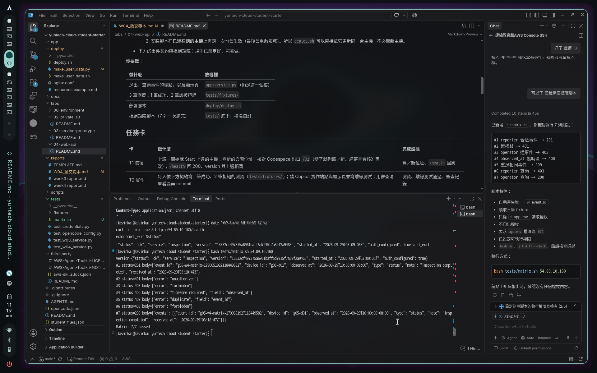

# W4 繳交：第一筆事件可送入、查詢並顯示

> **怎麼用**
>
> 1. 在 Codespace 的終端機執行：`mkdir -p .local && cp reports/W04_繳交範本.md .local/W04_繳交_<組內代號>.md`（`.local/` 不會進 Git）。
> 2. 打開 `.local/` 裡那份，把每個 `＿＿` 換成你的內容，勾選 `[x]`。
> 3. 在左邊檔案總管對它按右鍵 → **Download**，和顯示頁截圖一起上傳 TronClass。
>
> 貼上任何輸出之前先看一眼：**不能有權杖、私鑰、完整帳號 ID**。有的話先刪掉那一段。

## 基本資料

- 組名：第五組　組內代號：k4（例如 `g03`、`m2`；不用學號、姓名）
- 部署的 commit（前 7 碼）：858dd9dae1c69303d6606ba2cb8b00265c3fa5ca

## 1. `/health` 的回應

貼上 `curl -s http://<主機現在的公開位址>/health` 的輸出：

```
                date '+%Y-%m-%d %H:%M:%S %Z %z'                       
                curl -i --max-time 8 http://54.89.10.160/health
                echo "curl_exit=$status"
                2026-09-29 10:14:23 CST +0800
                HTTP/1.1 200 OK
                Server: nginx
                Date: Tue, 29 Sep 2026 02:14:23 GMT
                Content-Type: application/json; charset=utf-8
                Content-Length: 134
                Connection: keep-alive
                Cache-Control: no-store

                {"status": "ok", "service": "inspection", "version": "7726d01684969140b31a74396bb168c0ca868a72", "started_at": "2026-09-29T01:45:15Z"}curl_exit=0
```

- [v] `version` 開頭等於上面的 commit
- [v] `auth_configured` 是 `true`

## 2. 拒絕矩陣 7 列

貼上矩陣腳本**跑出來的完整輸出**，不要自己打、不要只填狀態碼。輸出要有：開頭的 `version`，以及每一列的編號、HTTP 狀態碼、服務回應的本文（README「拒絕矩陣」有規定格式）。

```
test_access_denied_never_retries_iam (test_credentials.CredentialTests.test_access_denied_never_retries_iam) ... ok
test_aws_arguments_no_shell (test_credentials.CredentialTests.test_aws_arguments_no_shell) ... ok
test_configure_verifies_before_saving_and_keeps_secrets_out_of_output (test_credentials.CredentialTests.test_configure_verifies_before_saving_and_keeps_secrets_out_of_output) ... ok
test_environment_cannot_override_account_or_endpoint (test_credentials.CredentialTests.test_environment_cannot_override_account_or_endpoint) ... ok
test_errors_are_sanitized (test_credentials.CredentialTests.test_errors_are_sanitized) ... ok
test_failed_configure_preserves_working_profile (test_credentials.CredentialTests.test_failed_configure_preserves_working_profile) ... ok
test_iam_user_rejected (test_credentials.CredentialTests.test_iam_user_rejected) ... ok
test_no_piped_secrets (test_credentials.CredentialTests.test_no_piped_secrets) ... ok
test_noninteractive_approval_rejected (test_credentials.CredentialTests.test_noninteractive_approval_rejected) ... delete scoped object
ok
test_preserve_other_profiles_and_clear_stale_settings (test_credentials.CredentialTests.test_preserve_other_profiles_and_clear_stale_settings) ... ok
test_wrong_account_stops (test_credentials.CredentialTests.test_wrong_account_stops) ... ok
test_both_model_roles_and_provider_allowlist_are_explicit (test_opencode_config.OpenCodeBoundaries.test_both_model_roles_and_provider_allowlist_are_explicit) ... ok
test_no_public_sharing_or_automatic_version_drift (test_opencode_config.OpenCodeBoundaries.test_no_public_sharing_or_automatic_version_drift) ... ok
test_sensitive_file_and_external_access_have_explicit_denials (test_opencode_config.OpenCodeBoundaries.test_sensitive_file_and_external_access_have_explicit_denials) ... ok
test_shell_and_edit_cannot_run_without_student_confirmation (test_opencode_config.OpenCodeBoundaries.test_shell_and_edit_cannot_run_without_student_confirmation) ... ok
test_health_version_and_unknown_route (test_w03_service.ServiceContract.test_health_version_and_unknown_route) ... /usr/lib/python3.14/tempfile.py:484: ResourceWarning: Implicitly cleaning up <HTTPError 404: 'Not Found'>
  _warnings.warn(self.warn_message, ResourceWarning)
ok
test_invalid_deployment_version_fails_closed (test_w03_service.ServiceContract.test_invalid_deployment_version_fails_closed) ... ok
test_authentication_and_authorization (test_w04_service.ServiceContract.test_authentication_and_authorization) ... /usr/lib/python3.14/tempfile.py:484: ResourceWarning: Implicitly cleaning up <HTTPError 401: 'Unauthorized'>
  _warnings.warn(self.warn_message, ResourceWarning)
/usr/lib/python3.14/tempfile.py:484: ResourceWarning: Implicitly cleaning up <HTTPError 403: 'Forbidden'>
  _warnings.warn(self.warn_message, ResourceWarning)
ok
test_health_and_fixture_validation (test_w04_service.ServiceContract.test_health_and_fixture_validation) ... /usr/lib/python3.14/tempfile.py:484: ResourceWarning: Implicitly cleaning up <HTTPError 400: 'Bad Request'>
  _warnings.warn(self.warn_message, ResourceWarning)
/usr/lib/python3.14/tempfile.py:484: ResourceWarning: Implicitly cleaning up <HTTPError 409: 'Conflict'>
  _warnings.warn(self.warn_message, ResourceWarning)
ok

----------------------------------------------------------------------
Ran 19 tests in 1.549s

OK
```

- [v] 開頭的 `version` 和第 1 段相同
- [v] #1 回應裡有 `event_id`（你的組內代號開頭）和 `received_at`
- [v] #4 回應的 `field` 是 `observed_at`
- [v] 回應裡沒有權杖

有哪一列和 README 的預期不同？原因是什麼？（全部相同就寫「無」）無

> 老師會對照三處：#1 回應的 `event_id` 與 `received_at`、#7 清單裡的同一筆、顯示頁截圖上的同一筆，三處要一致。

## 3. 顯示頁截圖（另外上傳）

檔名：`W04_顯示頁_<組內代號>.png`


- [v] 看得到第 2 段 #1 那筆的 `event_id` 和 `received_at`
- [v] 權杖輸入框已清空

## 4. 審查 Copilot 的程式

對照 README「審查 Copilot 的程式：四件事」：

| 四件事 | Copilot 第一版 | 沒過的話，你請它怎麼改 |
|---|---|---|
| 1. 先確認是誰，才看內容 | 過／沒過 | 過 |
| 2. 權杖、整筆事件不進日誌和錯誤回應 | 過／沒過 | 過|
| 3. 顯示頁用 `textContent`，權杖不放網址或瀏覽器 | 過／沒過 | 過 |
| 4. 你的 3 筆測資真的有被讀進去 | 過／沒過 | 過 |

## 5. 用自己的話說

一筆事件送到服務，依序經過哪幾道檢查？各擋下什麼樣的請求？（3–5 句）
 
 一筆事件送到服務需要經過網路層,安全群組,inspection服務,認證,授權,輸入驗證,重複檢查,建立後回應
 在這之中網路曾是負責發送請求,安全群組負責擋下非允許ip的請求,nginx部份負責接受由安全群組過濾後的公開請求,inspection負責讀取HTTP內部的方法路徑及JSON body,後續才是驗證資料格式並確保內部沒有相關重複資料送入資料庫部份

